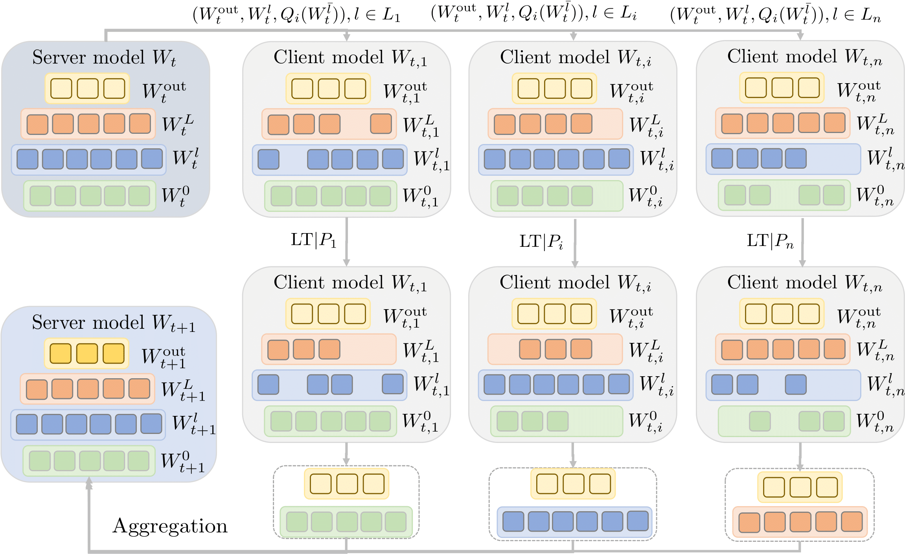

# FedP3

**FedP3: Federated Personalized and Privacy-friendly Network Pruning under Model Heterogeneity**\
Kai Yi, Nidham Gazagnadou, Peter Richtarik, Lingjuan Lyu\
ICLR 2024

[[Paper](https://openreview.net/forum?id=hbHwZYqk9T)]



The interest in federated learning has surged in recent research due to its unique ability to train a global model using privacy-secured information held locally on each client. 
This paper pays particular attention to the issue of client-side model heterogeneity, a pervasive challenge in the practical implementation of FL that escalates its complexity. 
Assuming a scenario where each client possesses varied memory storage, processing capabilities and network bandwidth - a phenomenon referred to as system heterogeneity - there is a pressing need to customize a unique model for each client.
In response to this, we present an effective and adaptable federated framework **FedP3**, representing **Fed**erated **P**ersonalized and **P**rivacy-friendly network **P**runing, tailored for model heterogeneity scenarios. 
Our proposed methodology can incorporate and adapt well-established techniques to its specific instances. We offer a theoretical interpretation of FedP3 and its locally differential-private variant, DP-FedP3, and theoretically validate their efficiencies.


## Getting Started

### Environment Setup

```angular2html
# create a conda virtual environment
conda create -n fedp3 python=3.8
# activate the conda environment
conda activate fedp3
pip install cachetools==4.1.1 scikit-learn==0.23.2 scipy==1.4.1
pip install torchvision==0.5.0 torch==1.4.0 numpy==1.18.1
# any other packages
```

### Optimal Layer Overlapping Among Clients
We first provide the ablation studies of `FedAvg`, `LowerB`, `OPU2` and `OPU3` under four standard small-medium scale datasets, including CIFAR-10, CIFAR-100, EMNIST-L and FashionMNIST. 

Our code supports downloading every dataset automatically from their corresponding official website. An running example is as follows:

```angular2html
python main.py --filepath OPU2_0000.txt --dataset CIFAR10 --method OPU2 --lr 0.01 --local_ep 10 --lr_decay 1 --rule noniid --dir_a 0.5 --gpu 0 --epoch 500 --beta 0.001 --bs 10 --local_bs 48
```

We also conduct extensive experiments on larger networks including ResNet18. An running example is 

```angular2html
python main.py --filepath OPU2_0000.txt --dataset CIFAR10 --method OPU2 --lr 0.01 --local_ep 10 --lr_decay 1 --rule noniid --dir_a 0.5 --gpu 0 --epoch 500 --beta 0.001 --bs 10 --local_bs 48
```

### Various Pruning Strategies
We are allowed to choose different pruning strategies, `fixed`, `uniform`, `od`. 

```angular2html
python main.py --pruning [fixed|uniform|od] --filepath OPU2_0000.txt --dataset CIFAR10 --method OPU2 --lr 0.01 --local_ep 10 --lr_decay 1 --rule noniid --dir_a 0.5 --gpu 0 --epoch 500 --beta 0.001 --bs 10 --local_bs 48
```

### Flexible Aggregation Strategies
We are allowed to choose different pruning strategies, `mean`, `weight`. 

```angular2html
python main.py --agg [mean|weight] --filepath OPU2_0000.txt --dataset CIFAR10 --method OPU2 --lr 0.01 --local_ep 10 --lr_decay 1 --rule noniid --dir_a 0.5 --gpu 0 --epoch 500 --beta 0.001 --bs 10 --local_bs 48
```


## Future Work
- [ ] Allow partial client participation


## Contact

If you have any questions regarding the code and the paper, please feel free to contact Kai Yi (williamyi96@gmail.com).


## Citation
If you find this repository useful for your research, please consider citing our work:

```bibtex
@article{FedP3,
	author={Yi, Kai and Gazagnadou, Nidham and Richtarik, Peter and Lyu, Lingjuan},
	journal={International Conference on Learning Representations (ICLR)},
	title = {FedP3: Federated Personalized and Privacy-friendly Network Pruning under Model Heterogeneity},
	year = {2024}}
```